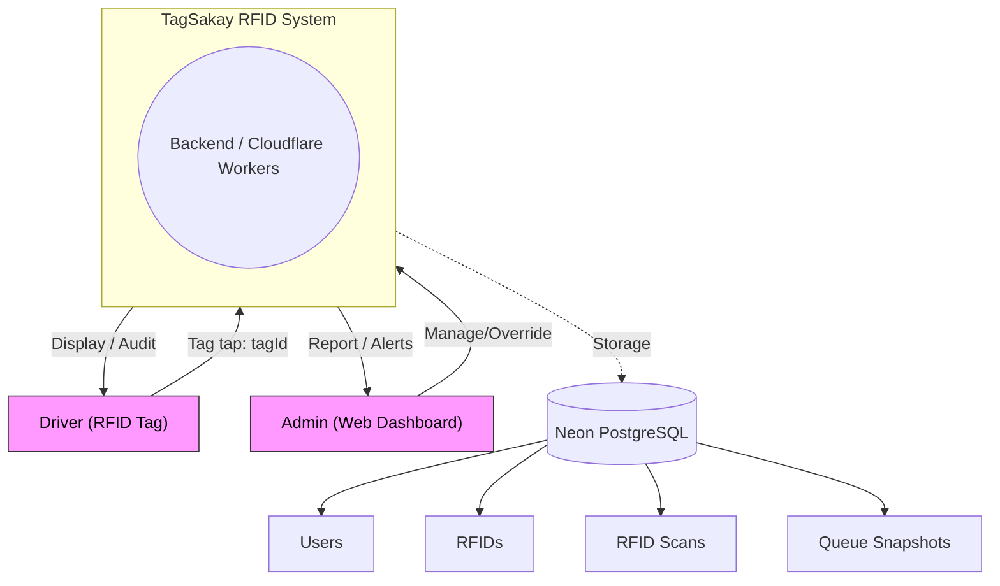
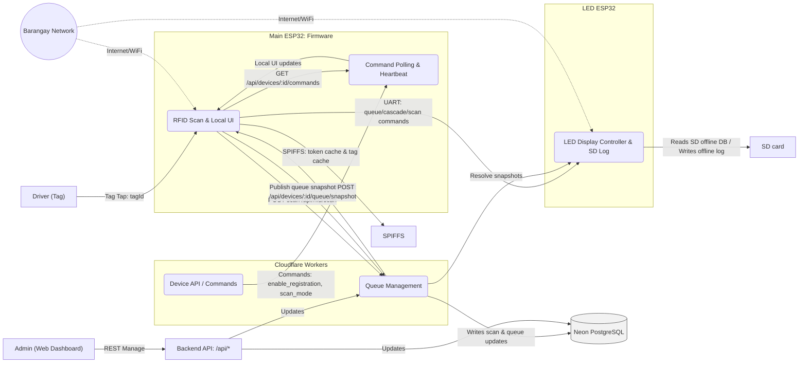
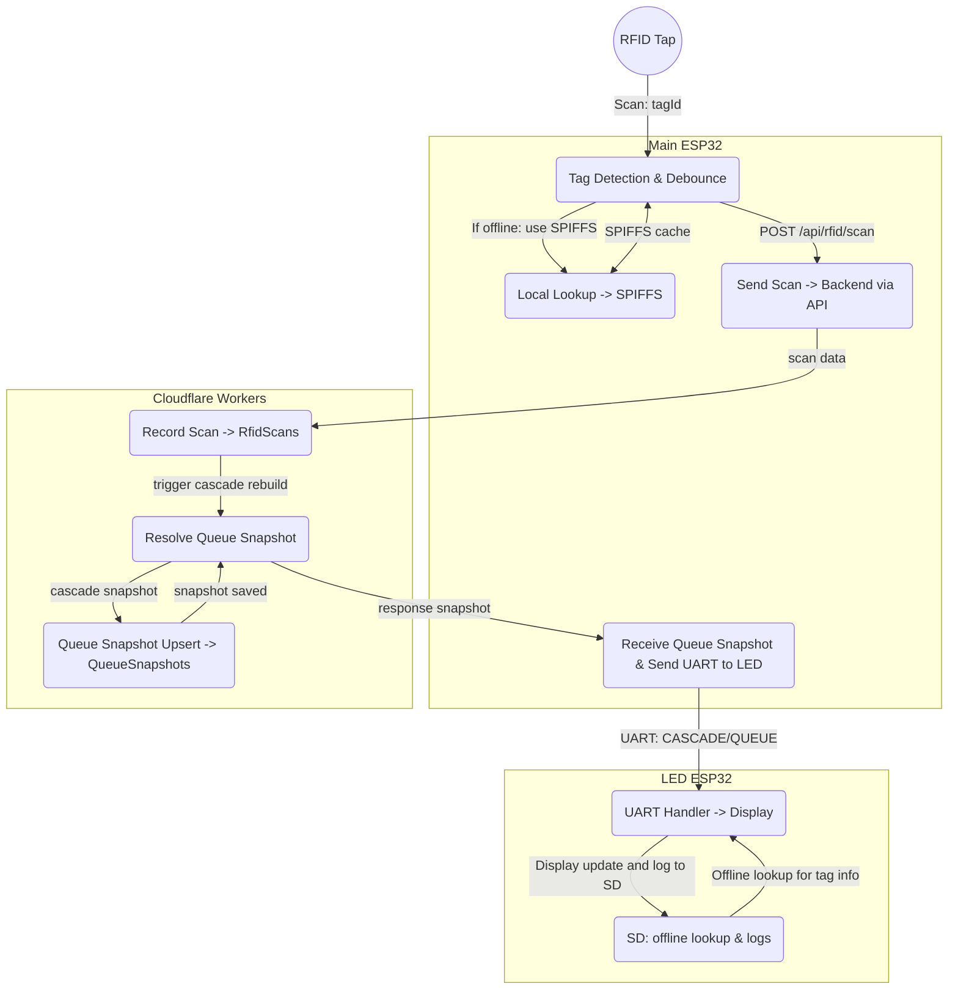

# TagSakay: Data Flow Diagrams (DFDs)

This document contains Data Flow Diagrams (DFDs) for the TagSakay RFID system. It follows the standard DFD levels (Context / Level 0, Level 1, Level 2) described in GeeksforGeeks: "Levels in Data Flow Diagrams (DFD)" (https://www.geeksforgeeks.org/software-engineering/levels-in-data-flow-diagrams-dfd/).

The goal is to illustrate how data flows across the hardware and software components described in the codebase:

- Firmware: `TagSakay_Fixed_Complete/` (ESP32 main), `TagSakay_LED_Matrix/` (LED controller)
- Backend: `backend-workers/` (Cloudflare Workers + Neon PostgreSQL)
- Frontend: `frontend/` (Vue 3 admin dashboard)

The DFDs map each process to the code artifacts implementing it for traceability and easier review.

---

## Context / Level 0 DFD (System Context)

- System boundary: TagSakay RFID System
- External entities: Drivers (RFID tag users), Admin (web dashboard user), Barangay Network (Connectivity provider)
- Key data stores (within the system boundary): `Users`, `RFIDs`, `RfidScans`, `QueueSnapshots`

Mermaid Diagram (Level 0):

Explanation:

- The whole TagSakay project is presented as a single system in Level 0. It receives RFID taps from drivers (via the main ESP32 firmware), accepts admin commands via the web dashboard, and stores/serves data in the backend database. The LED display is an internal component (part of the system) that provides user feedback.

---

## Level 1 DFD (Top-Level Decomposition)

Level 1 decomposes the system into main processes and shows flows between them. Processes are mapped to code modules used in the repo.

Core processes:

1. RFID Scanning & Local UI (Main ESP32)
2. Queue Management (Backend)
3. Device Command Polling & Heartbeats (Main ESP32)
4. LED Display Controller (LED ESP32)
5. Admin Dashboard (Frontend) — management and overrides

Mermaid Diagram (Level 1):

Level 1 Process mappings to code artifacts:

- P1: RFID Scan & Local UI — `TagSakay_Fixed_Complete/TagSakay_Fixed_Complete.ino`, `RFIDModule.*`, `DisplayModule.*`, `KeypadModule.*`, `HTTPPolling.*` (for polling integration)
- S2: Queue Management — `backend-workers/src/routes/rfid.ts` (scan recording), `backend-workers/src/lib/queueSnapshot.ts` (normalization and snapshot building), `backend-workers/src/routes/device.ts` (queue snapshot upsert)
- P3: Command Polling & Heartbeat — `TagSakay_Fixed_Complete/HTTPPolling.cpp`, `TagSakay_Fixed_Complete/ApiModule.cpp` (`sendDeviceHeartbeat` / `reportStatus`), backend GET `/api/devices/:deviceId/commands`
- P4: LED Display Controller & SD Log — `TagSakay_LED_Matrix/TagSakay_LED_Matrix.ino`, `UARTHandler.cpp`, `SDCardModule.cpp`, `DisplayCore.cpp`, `PixelFont.cpp`
- Admin (Frontend) — `frontend/src/views/*`, `frontend/src/services/api.ts` (dashboard), uses backend endpoints to manage devices and tags

---

## Level 2 DFD (Detailed breakdown of RFID Scan & Queue Management)

This level focuses on the end-to-end sequence from a tag tap to a queue update and display refresh. It maps to the firmware-backend-LED pipeline with more detail.

Key sub-processes for Level 2 decomposition:

- 2.1: Tag Detection (PN532) and Debounce
- 2.2: Local Lookup & Display Update (SPIFFS cache / local UI)
- 2.3: POST Scan & Server Reporting (HTTP)
- 2.4: Backend processing & Queue Snapshot generation
- 2.5: Snapshot Publication & LED Update (via UART)

Mermaid Diagram (Level 2):

Detailed notes and responsibilities:

- 2.1 (Tag Detection & Debounce): `RFIDModule::scanWithDebounce()` ensures duplicate taps are filtered. This function uses the PN532 library to detect tags. The debounce and duplicate prevention logic come from `RFIDModule.cpp`.
- 2.2 (Local Lookup & Display Update): On a successful scan, `ApiModule::getRfidDetails()` is called to obtain the user/unit info. If the device is offline or the fetch fails, the firmware will try `SPIFFS` cache via `loadTagData()`; successful lookups are stored via `saveTagData()`.
- 2.3 (Send Scan -> Backend): After successful validation, scan events are POSTed to `/api/rfid/scan` (Device-authenticated). Server validates the tag and records the `RfidScans` row.
- 2.4 (Backend processing & Queue Snapshot generation): Backend writes the scan to `RfidScans` and uses `resolveCascadeSnapshot()` (and `buildCascadeSnapshot()`) to translate recent ongoing scans into a cascade snapshot (the `QueueSnapshots` model), which is normalized into `slots`, `cascade` and `totalActive` fields.
- 2.5 (Snapshot Publication & LED Update): After queue snapshot is available, the backend (or the device's `publishQueueSnapshot`) updates snapshots via `/api/devices/:deviceId/queue/snapshot`. The main ESP sends `CASCADE` or `QUEUE` via UART to LED controller; LED controller uses `SDCardModule` for offline names lookup and logs offline scans.

---

## Mapping of Symbols & Conventions Used

- External Entities (rectangle): Driver (RFID tag) and Admin (Web Dashboard)
- Processes (bubble/circle/rounded rectangle): Firmware/ESP32 processes (RFID scanning, polling, queue logic) and Backend processes (Queue Management, device API)
- Data Stores: Postgres tables (`Users`, `RFIDs`, `RfidScans`, `QueueSnapshots`)
- Data Flows: HTTP POST/GET, UART transmissions (TX-only), SPIFFS & SD read/write

---

## Where to find the code that maps to the DFD components

- Firmware / Main ESP32:

  - `TagSakay_Fixed_Complete/TagSakay_Fixed_Complete.ino` (main loop and process orchestration)
  - `TagSakay_Fixed_Complete/RFIDModule.cpp` — tag reading and debounce logic
  - `TagSakay_Fixed_Complete/HTTPPolling.cpp` — command polling and `processCommand()`
  - `TagSakay_Fixed_Complete/ApiModule.cpp` — `getRfidDetails()`, `sendQueueSnapshot()`, `reportStatus()`
  - `TagSakay_Fixed_Complete/UARTModule.cpp` — `sendToLEDMatrix()` message format
  - `TagSakay_Fixed_Complete/KeypadModule.cpp` — Admin overrides
  - `TagSakay_Fixed_Complete/TagSakay_Fixed_Complete.ino` — SPIFFS usage `saveTagData()` / `loadTagData()`

- LED ESP32:

  - `TagSakay_LED_Matrix/TagSakay_LED_Matrix.ino` — LED main loop
  - `TagSakay_LED_Matrix/UARTHandler.cpp` — `parseCommand()` and `handleCommand()`; `OFFLINE_SCAN` / `SDTEST` / `SYNC_DB` commands
  - `TagSakay_LED_Matrix/SDCardModule.cpp` — `lookupUnitByTag()`, `lookupUserByTag()`, read/write utilities
  - `TagSakay_LED_Matrix/DisplayCore.cpp`, `PixelFont.cpp` — rendering and double-buffering

- Backend / Cloudflare Worker:
  - `backend-workers/src/routes/rfid.ts` — POST `/api/rfid/scan`, scan validation and saving to DB
  - `backend-workers/src/routes/device.ts` — POST `/api/devices/:id/queue/snapshot`, GET `/api/devices/:id/commands` (polling endpoint used by ESP32 devices)
  - `backend-workers/src/lib/queueSnapshot.ts` — `normalizeDeviceSnapshotPayload`, `buildCascadeSnapshot`, `resolveCascadeSnapshot` (core snapshot logic)
  - `backend-workers/src/db/schema.ts` — schema for `Users`, `RFIDs`, `RfidScans`, `QueueSnapshots`

---

## Notes & Validation checklist

- This DFD has been designed following the DFD levels described by GeeksforGeeks; Level 0 provides a system context, Level 1 decomposes the major system processes, and Level 2 decomposes the RFID & queue pipeline for technical validation.
- If needed, Level 2 could be expanded further into additional levels to describe more detailed artifacts (e.g., `ApiModule::sendBatchScans()`, `queueSnapshot` normalization steps).
- The diagrams above should be suitable for both technical reviewers and auditors, and can be included in the thesis as Level 0/1/2 DFD illustrations.

---

## References

- GeeksforGeeks — Levels in Data Flow Diagrams (DFD): https://www.geeksforgeeks.org/software-engineering/levels-in-data-flow-diagrams-dfd/
- Repository artifacts referenced throughout the DFD are present in the repo (see sections and file references above).

---
